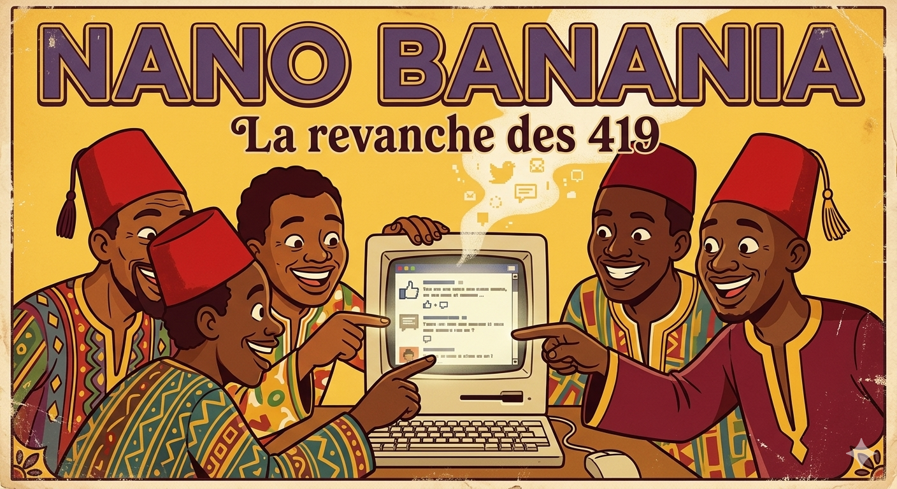

# The Ocarina Holy Book

[📖 Amen.](https://mojo-molotov.github.io/ocarina-holy-book)

## See also

[🎶 Ocarina](https://github.com/mojo-molotov/ocarina)  
[📙 Ocarina canonical example](https://github.com/mojo-molotov/ocarina-example)

## License

MIT — Igor Casanova.

---

Built by [@mojo-molotov](https://github.com/mojo-molotov)  
Fueled by figatellu and Квас.

🤖 Illustrations proudly generated with Nano Banania 2 (as in Abidjan 🇨🇮).

  

**This project is not affiliated with or endorsed by Banania.**  
**Banania is a trademark of Nutrimaine SAS.**
