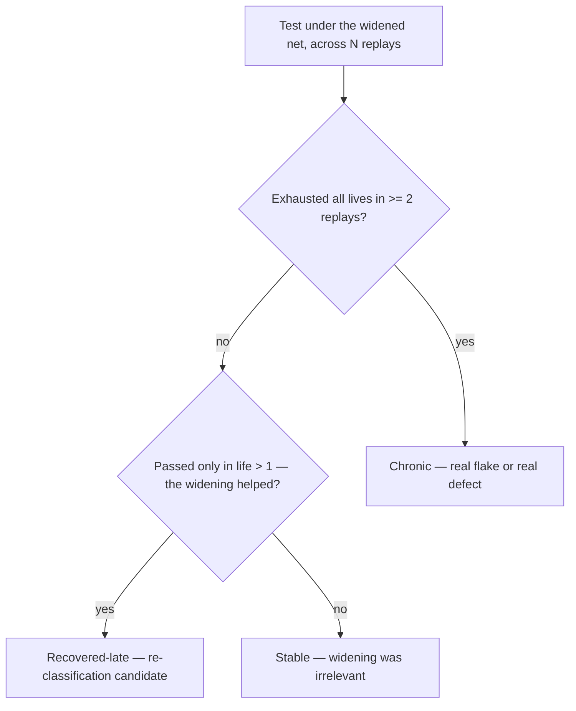

# Analyse flakiness — widen the transient net, watch what still dies

A diagnostic skill. Ocarina retries on transient errors; non-transient errors kill the test immediately. The classification of _which exception goes
where_ is itself a load-bearing assumption — and the only way to audit it empirically is to **break the classification on purpose**, let everything
retry, and watch what fails to recover.

Two complementary outputs:

- **Chronic-death map** — tests / steps / exception classes that _still_ die after N retries across M replays. This is where the real flake (or real
  defect) lives.
- **Classification audit** — exceptions currently classified as **non-transient** but which, when widened to transient, recover within the retry
  budget. These are candidates for re-classification.

The skill **never** commits the widened net. The widening is a local experiment; the _findings_ land in the gap inventory, a comment on the exception
class, or a deliberate change to `src/lib/errors.py`. The temporary diff gets reverted at the end.

## The mechanism

Ocarina's error classification lives in `src/lib/errors.py` (and adjacent — confirm by reading before you edit). The retry loop reads `is_transient`
(or equivalent) on the exception; True → retry within the test-life budget; False → the test dies on the spot.

The experiment:

1. **Temporarily widen** the classifier so _every_ exception is transient (or at least: every exception currently not transient).
2. **Run the suite** (or a subset) at its normal `lifes_per_test` count, across **multiple replays** (default 3) and **both browsers** when relevant.
3. **Collect** the per-test outcome: did it pass within its lives? On which life? Or did it exhaust all lives?
4. **Classify the deaths**:
   - **Chronic death** — exhausted all lives on multiple replays → real flake or real defect.
   - **Recovered late** — passed on life N>1 → the original classification was too narrow; the exception is genuinely transient.
   - **Recovered always on life 1** — irrelevant noise; the widening didn't matter for this test.
5. **Surface the findings.** The user picks what to re-classify, what to file as a flake / defect, what to leave alone.
6. **Restore** the original classifier. The widening is never committed.

## Procedure

### Step 1 — Restate the hypothesis

"The post-login flake on `test_appointment_booking` looks like contention, but I'm not sure the classification is right." Or "Audit all non-transient
exceptions — are any of them actually transient under load?" Or "Find the chronic death spots in the suite."

A narrow hypothesis runs on a single scenario file with high replay count. A broad audit runs on the full suite with the default replay count.

### Step 2 — Locate the current classifier

```bash
grep -rn "is_transient\|TransientError\|NonTransient" src/lib
```

Read the relevant file(s). Identify:

- The function / property that decides transient vs non-transient.
- The list (or pattern) of exception classes currently marked non-transient.
- Any explicit non-transient subclasses (e.g. `BackForwardCacheExposureError` per the project's BFcache work).

Note these for the restore step.

### Step 3 — Surface the experiment plan

Before editing anything, print the plan:

```markdown
# Flakiness-analysis plan

## Hypothesis

<one-sentence>

## Widening

- File: `src/lib/errors.py:<line>`
- Change: <before> → <after>. Effect: every exception currently non-transient becomes transient.

## Excluded from widening (stay non-transient)

- `BackForwardCacheExposureError` — diagnostic exception; widening would mask §B-BROWSER-1 finding.
- <any other intentionally non-transient class — list them>.

## Run shape

- Scope: <full suite | a scenario | a suite>.
- Browsers: <chrome | firefox | both>.
- Replays: <N, default 3>.
- Lives per test: as configured (don't override).
- Workers: <as configured | 1 if isolation matters>.

## Output capture

- Logs root: latest `.ocarina_logs_<id>/` per `pick-logs`.
- Reports: latest `.reports/json/<uuid>.json` per `pick-reports`.

## Restore

- Revert the widening at the end. Do not commit.
```

Wait for the user's go. The widening is authoring data (it changes which deaths are visible) — per the project's "Datasets are authoring decisions"
rule, the user signs off.

### Step 4 — Apply the widening

A minimal edit. Two shapes are common:

- **Make the classifier permissive**: change the body so the transient-check returns True for the previously-non-transient set (except the explicit
  exclusions).
- **Re-tag specific classes**: flip the `transient = False` flag on the classes whose flakiness you want to expose, one by one (more surgical, more
  signal).

Prefer the surgical shape when you have a hypothesis about a specific exception. Prefer the permissive shape when the audit is broad ("which
non-transient exceptions are actually transient?").

Run `ruff format && ruff check && mypy` after the edit — a broken classifier won't survive the run-loop.

### Step 5 — Run the experiment

Drive the run shape from Step 3. For multi-replay, use the same invocation N times (or whatever the project's replay primitive is). Capture:

- The exit status of each replay.
- The latest log root after each replay (mtime, not name — per `pick-logs`).
- The JSON report (per `pick-reports`).

Don't conflate replays. Each replay is its own observation.

### Step 6 — Build the chronic-death table

For each test across all replays, extract:

| Test | Browser | Lives used | Final outcome | Exception class at last death | Step at last death |

Then collapse by `(test, browser, exception class, step)`:

- **Chronic** — failed in ≥ 2 of N replays after exhausting lives.
- **Recovered-late** — passed in life > 1 in ≥ 1 replay (the widening helped).
- **Stable** — passed in life 1 every replay (widening was irrelevant for this test).

The sort is two questions per test — render it in the skill's surfaced report so each verdict is auditable (that Markdown deliverable only; never
commit it into the repo):



Cross-reference the chronic deaths to the gap inventory:

- Matches `§A-ENV-1` (rapid-POST shared-dyno contention)? — explained, no new finding.
- Matches `§A-ENV-2` (Chrome password-breach modal)? — explained.
- Matches a `B-BROWSER-*` entry? — explained.
- Matches none → **new flake candidate**.

### Step 7 — Surface the findings

Use this exact template:

```markdown
# Flakiness analysis — <one-sentence hypothesis>

## Experiment

- Widening: <surgical | permissive>; exclusions: <list>.
- Run shape: <scope>, <browsers>, <N> replays, lives per test <as configured>.

## Chronic deaths (real flakes / defects)

| Test     | Browser | Replays failed | Exception                         | Step                    | Cross-ref     |
| -------- | ------- | -------------- | --------------------------------- | ----------------------- | ------------- |
| `test_X` | chrome  | 3/3            | `WebDriverException: …`           | `…click()` after submit | unknown → new |
| `test_Y` | firefox | 2/3            | `TimeoutException` waiting on `…` | post-redirect           | §A-ENV-1?     |

## Recovered-late (re-classification candidates — currently non-transient, behaves transient)

| Exception class                                               | Where raised | Recovered on life | Comment                                                      |
| ------------------------------------------------------------- | ------------ | ----------------- | ------------------------------------------------------------ |
| `StaleElementReferenceException` (if currently non-transient) | <call site>  | 2 or 3            | classify as transient — DOM re-render is genuinely retryable |

## Stable under widening (no signal)

- <count> tests passed on life 1 across all replays. Widening didn't matter for them. Listed in appendix.

## Cross-references

- §A-ENV-1 / §A-ENV-2 / §B-BROWSER-1 — which chronic deaths these explain.
- `src/lib/errors.py:<line>` — classifier under audit.

## Open follow-ups

- <chronic death with no cross-ref> — file as new `G-*` / `B-*` entry? Run `write-a-probe` to isolate?
- <re-classification candidate> — change `is_transient` for class X? Surface as `update-frd-and-tests` style change?

## Verdict

<one-line: N chronic deaths, M re-classification candidates, K resolved-by-cross-ref, nothing material>.
```

### Step 8 — Restore the classifier

```bash
git diff -- src/lib/errors.py
git checkout -- src/lib/errors.py
# or revert the edit by hand if other changes are mixed in
```

Confirm the restore with a second `git diff`. The widening was a probe; it gets discarded.

If the analysis surfaced a _deliberate_ re-classification the user wants to keep, that's a separate, signed-off change — landed via the
`update-frd-and-tests` motion (with a comment on the class citing this analysis as the empirical evidence). Not via leaving the widened diff in.

### Step 9 — Stop. The user decides.

Each finding can resolve as:

- **File** — new entry in the gap inventory (`G-*`, `B-*`, or `A-ENV-*` depending on shape).
- **Re-classify** — flip `is_transient` for a specific exception class, with a comment citing this analysis.
- **Probe further** — invoke `write-a-probe` for the chronic death to isolate the root cause.
- **Defer** — interesting but not actionable this pass.

The analysis doesn't apply. It surfaces.

## Hard rules

- **Never commit the widening.** It's a local probe of the classifier. The restore step is non-optional.
- **Always exclude diagnostic non-transient classes** (`BackForwardCacheExposureError` etc.) from the widening. Those exist _because_ they should kill
  the test; widening them masks the finding they're built to surface.
- **Multiple replays are mandatory.** A single replay can't distinguish chronic from one-off. Default 3; more for low-signal hypotheses.
- **Don't conflate widening-uncovered flakes with SUT defects.** A test that dies chronically under the widening can be: a SUT defect (`G-*`), a
  browser quirk (`B-*`), an environment artifact (`A-ENV-*`), or a test-code bug (a stale selector, a race in a POM). The classification is the user's
  call after seeing the cross-refs.
- **Read `errors.py` before editing.** The current classifier shape might not match the assumptions above; adapt.

## When to run this skill

- A test fails intermittently and you can't tell if it's transient or a defect.
- A `review-suite-stability` audit surfaces flakes with no clean explanation.
- A new exception class lands in the suite — is it correctly classified?
- After a major dependency bump (the driver adapter — Selenium or Playwright — or the browser) — did the bump change which exceptions fire?
- Onboarding to the project — a flake-map gives a contributor the shape of the suite's failure surface.

## What this skill does NOT do

- It does not run automatically without the user's go on the experiment plan.
- It does not commit the widened classifier. Never.
- It does not flip `is_transient` on a class as a _fix_. That's a separate, signed-off motion via `update-frd-and-tests`.
- It does not write new tests. (Use `extend-coverage` / `empiricism` for that.)
- It does not run probes (`write-a-probe`) to isolate root causes — it surfaces the chronic spots; isolation is a follow-up motion.
- It does not include attack-shape inputs in any retry. Per `CLAUDE.md` → "Security testing is functional and static — never active".
