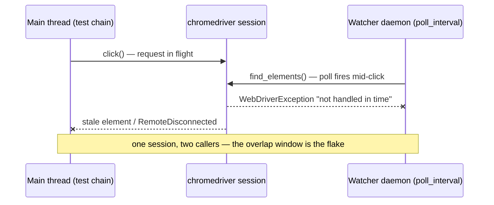

# Analyse watcher flakiness — concurrency at the test boundary

A diagnostic skill for Ocarina's `Watcher` primitive: a background daemon thread that polls a user-defined callback while the test chain runs in the
main thread. Watchers are powerful (cookie-banner detection, console-error reporting, drift alarms) and surprising — they share a `driver` with the
main thread, their callback exceptions are swallowed by design, and their `report()` produces side effects (logs + screenshots) that interleave with
the main flow.

Distinct from:

- `analyse-flakiness` — hunts flakes in test bodies via the transient-error classifier.
- `analyse-fixture-flakiness` — hunts flakes at the setup / teardown boundary.
- **this skill** — hunts flakes in the _concurrent observer_ surface.

## The watcher failure shapes (eight)

Recall the contract (`ocarina/dsl/testing/watcher.py`): the watcher spawns a daemon, polls `callback(self)` every `poll_interval` seconds, exposes
`driver` / `cache` / `report(msg)`, **silently suppresses every callback exception**, and is joined by `stop()`. Each part of that contract is a
failure surface.

### 1. Concurrent driver access (the big one)

Selenium WebDriver clients are **not thread-safe**. The watcher's callback reads `driver.find_elements(...)` while the main thread is mid-`click()`.
(On the Playwright adapter the shape differs: the `PlaywrightDriver` marshals every call onto a single owner thread via `driver.submit`, so two
threads can't hit the page concurrently — but a watcher callback that issues its own `driver.submit` still contends for that owner thread and can
deadlock or starve the main interaction. Same _category_ of bug, different mechanism.) Symptoms:

- `WebDriverException: ... was not handled in time` from either thread (Selenium); a stalled / timed-out `driver.submit` (Playwright).
- Stale element references in the test body that _only_ appear with the watcher attached.
- Random `URLError` / `RemoteDisconnected` from the chromedriver process under poll pressure.

Audit by running the same scenario with and without the watcher attached. If the flake disappears when the watcher is detached, the watcher is the
cause.

The race is two threads reaching for one non-thread-safe driver session — a sequence diagram makes the collision window concrete (it belongs in the
skill's surfaced report only; never commit it into the repo):



### 2. Swallowed callback exceptions

The contract: any exception raised inside the callback is `suppress`-ed. Failure shape: a callback **silently broken** (NameError after a refactor, a
selector drift, a None deref) becomes a watcher that _appears_ to be running but _never reports_. The test passes, the report is empty, the signal is
lost.

Audit by injecting a forced `report()` at the start of the callback (sanity-check it can still fire), or by temporarily _removing_ the `suppress` so
the exception lands somewhere visible.

### 3. Poll interval — too tight

Sub-100ms poll intervals hammer the driver, slow the test body, and amplify §1's concurrency surface. Sub-500ms can already destabilise rapid POSTs on
a shared eco dyno (§A-ENV-1).

Audit by varying `poll_interval` across runs: e.g. `0.1`, `0.5`, `1.0`, `2.0`. Plot test-body duration / flake rate against interval. A steep curve at
low intervals is the watcher overloading the driver.

### 4. Poll interval — too loose

Inverse problem. A 5-second poll on a sub-second banner means the banner appears and disappears between two poll cycles and is _never seen_. The
watcher exists but produces zero reports.

Audit by adding a known-fast trigger (a banner that flashes for 200ms) and seeing whether each tested interval catches it.

### 5. Cache pathology

`watcher.cache` is a mutable `set[str]`. Two failure shapes:

- **Fingerprint collision** — two distinct signals hash to the same string, second one is silently dropped.
- **Unbounded growth** — a long-running watcher (smoke gate + full campaign) keeps growing the cache, eventually slowing the callback or eating memory
  on the worker.

Audit by dumping `len(watcher.cache)` at `stop()` time. If the count grows linearly with test count and never shrinks, that's the leak.

### 6. report() racing with main-thread screenshots

`report()` calls `take_screenshot` (per the watcher contract). The main thread also takes screenshots on failure (per the Ocarina hooks). Both touch
the same driver and the same screenshot folder. Symptoms:

- Ghost screenshots: a `report()` capture that landed _between_ the test body's last action and the framework's failure capture, blurring the
  timeline.
- File-collision artifacts: two screenshot writes within the same millisecond producing a truncated file.
- A screenshot that shows the page _as the watcher saw it_, not the page that caused the test failure, leading to a misdiagnosis.

Audit by tagging watcher-issued screenshots distinctly (a `[watcher: <name>]` log line right before the call) so the `pick-screenshots` pass can
disambiguate.

### 7. Stop / join boundary

If `stop()` is called but the daemon is in the middle of a slow callback (a `find_element` waiting on an implicit wait), the join may take seconds —
or, if the framework doesn't `join` properly, the daemon outlives the test and starts polling the _next_ test's driver. Cross-test contamination.

Audit by logging `enter_callback` / `exit_callback` at the watcher level and checking whether any `exit_callback` lands after the next test's
`acquire_driver` (per `analyse-fixture-flakiness`).

### 8. Watcher-induced false negatives

A watcher is _expected_ to fire on a known condition (e.g. cookie banner appears). If, in a replay batch, the watcher fires only 7 of 10 times when
the banner appeared all 10, the watcher itself is flaky — usually a combination of §3 (interval too loose) and §1 (driver contention during the
relevant window).

Audit by replay count: same scenario, N replays, count watcher firings. Anything less than 100% on a deterministic trigger is a watcher flake.

## Procedure

### Step 1 — Inventory the watchers

```bash
grep -rn "Watcher\[" src
grep -rn "watchers=" src
```

If the result is empty (currently true for the project), the skill's output is a **pre-flight checklist** for the _next_ watcher to land — useful when
reviewing a PR that introduces one. If non-empty, list each: name, callback, `poll_interval`, where attached (which scenario / suite).

### Step 2 — Restate the hypothesis

"Cookie-banner watcher is firing inconsistently in CI." Or "The new console-error watcher might be slowing test_appointment_booking." Or "Pre-flight
an audit before merging the watcher in PR #N." Or "Audit all watchers — no specific suspect."

### Step 3 — Surface the experiment plan

```markdown
# Watcher-flakiness analysis plan

## Hypothesis

<one-sentence>

## Watchers under scrutiny

- `<name>` — callback `<path:line>`, poll_interval `<s>`, attached to `<scenario(s)>`.

## Failure shapes to check (from the eight)

- §1 concurrent driver access — run with / without the watcher attached.
- §2 swallowed callback exceptions — inject a forced `report()` at callback entry.
- §3 / §4 poll interval — sweep `[0.1, 0.5, 1.0, 2.0]` seconds.
- §5 cache pathology — log `len(watcher.cache)` at stop.
- §6 screenshot racing — tag watcher reports with `[watcher: <name>]`.
- §7 stop / join boundary — log `enter_callback` / `exit_callback` per cycle.
- §8 firing rate on known trigger — N replays against a deterministic banner.

## Instrumentation (temporary, will be reverted)

- `src/<callback file>.py:<line>` — log entry / exit / cache size.
- `src/<scenario file>.py:<line>` — toggle to attach / detach the watcher.

## Run shape

- Replays: <N, default 5>.
- Browsers: <chrome | firefox | both>.
- Workers: <as configured>.
- Two passes per interval: with-watcher / without-watcher.

## Output capture

- Logs root per `pick-logs`.
- Screenshots per `pick-screenshots` — filter for `[watcher: …]` tag.

## Restore

- Revert all instrumentation + put the original watcher config back. Do not commit.
```

Wait for the user's go. Modifying a watcher (or its attachment) is authoring data.

### Step 4 — Instrument

Minimal additions, then revert at the end:

- **Lifecycle**: log lines at `start`, `stop`, every `enter_callback` / `exit_callback`, plus `len(cache)` at `stop`.
- **Screenshot tagging**: precede each `report()` with a `logger.info("[watcher: <name>] reporting <msg>")` so screenshots can be back-traced.
- **Exception visibility (audit-only)**: temporarily replace the `suppress` with
  `except Exception as exc: logger.exception("watcher callback raised")` so swallowed errors land in logs. **This is in the Ocarina source under
  `<gitignored>/ocarina/`**; the project's memory documents that path. Make the edit there, run, revert. Never commit changes to the Ocarina source
  from this skill.

Run `ruff format && ruff check && mypy` on the project side.

### Step 5 — Run the experiment passes

For each watcher × each poll interval × {with, without}: replay N times. Capture logs / reports / screenshots per pass.

Don't cross-pollinate: each combination is its own observation set.

### Step 6 — Build the per-watcher table

| Watcher         | Pass (interval, attached?) | Test body duration (median) | Test body flake rate | Watcher firings on trigger | Cache size at stop | Callback exceptions caught |
| --------------- | -------------------------- | --------------------------- | -------------------- | -------------------------- | ------------------ | -------------------------- |
| `cookie_banner` | 0.5s, attached             | 14.2s                       | 1/5                  | 5/5                        | 3                  | 0                          |
| `cookie_banner` | 0.5s, detached             | 13.8s                       | 0/5                  | n/a                        | n/a                | n/a                        |
| `cookie_banner` | 0.1s, attached             | 18.7s                       | 3/5                  | 5/5                        | 3                  | 0                          |
| `cookie_banner` | 2.0s, attached             | 14.0s                       | 0/5                  | 2/5                        | 1                  | 0                          |

The shape of the table tells you the watcher's safe operating point: the row with healthy test-body duration, low flake rate, and full firings on the
trigger.

### Step 7 — Surface the findings

```markdown
# Watcher-flakiness analysis — <one-sentence hypothesis>

## Experiment

- Watchers tested: <list>.
- Intervals swept: <list>.
- Run shape: <N> replays × <browsers> × {attached, detached}.

## Findings per watcher

### `<watcher name>`

- **§1 (concurrent driver access)**: <flake delta with-vs-without — N/N>. <Conclusion>.
- **§2 (swallowed exceptions)**: <count caught>. <Specific exception classes if any>.
- **§3 / §4 (poll interval)**: safe range <a..b s>. Best operating point: <s>.
- **§5 (cache)**: max size at stop <count>. <Growth pattern>.
- **§6 (screenshot racing)**: <ghost shots found? cross-references to specific files>.
- **§7 (stop / join)**: <late exits found? cross-test contamination?>.
- **§8 (firing rate on known trigger)**: <N/N>. <Below 100% explanation if any>.

- **Recommendation**: <keep as-is | adjust poll_interval to X | rewrite callback (cite reason) | remove>.

## Cross-references

- the gap inventory <entry-refs> — does any watcher-induced flake match an existing entry?
- `CLAUDE.md` rule on <topic> — supported / could be tightened?
- Ocarina source `.../watcher.py:<line>` — observed behaviour.

## Open follow-ups

- <watcher to rewrite> — surface via PR; cite this analysis.
- <unexplained ghost screenshots> — handoff to `pick-screenshots` + manual repro.

## Verdict

<one-line: N watchers safe, K need adjustment, J should be removed, nothing material>.
```

### Step 8 — Restore everything

```bash
git diff -- src
git checkout -- <each instrumented file>

cd <gitignored>/ocarina
git diff
git checkout -- <each instrumented file>  # restore the Ocarina audit edits
cd -
```

Confirm with a final `git diff` in both trees. The watcher itself, the scenario attachment, and the Ocarina audit edits all revert. The _findings_
land elsewhere (a comment on the callback citing this analysis, a gap-inventory entry, or a deliberate PR adjusting `poll_interval` with this analysis
as the empirical basis).

### Step 9 — Stop. The user decides.

Each finding can resolve as:

- **Adjust the watcher** — change `poll_interval`, rewrite the callback for cheaper polling, swap to event-driven detection.
- **Remove the watcher** — if it costs more flake than it catches.
- **File as gap** — an adapter/driver concurrency artifact (Selenium/chromedriver, or Playwright owner-thread contention) landing in the gap
  inventory.
- **Promote** — if the watcher is solid, document its operating point in a comment on the callback
  (`# poll_interval=1.0 is the empirical safe point; see <date> analysis`).

## Hard rules

- **Never commit the instrumentation.** Project side and Ocarina side both. Restore is mandatory.
- **Never run a watcher with attack-shape side effects.** Per `CLAUDE.md` → "Security testing is functional and static — never active". A watcher that
  _probes_ the SUT (extra requests, injection-shaped reads) is out of scope; a watcher that _observes_ via the existing browser session is fine.
- **Multiple replays + with/without pairs are mandatory.** A watcher's effect on flake rate is only visible against its detached baseline.
- **Don't dump full DOM into logs.** Cache fingerprints / counts only — the same discipline as `analyse-fixture-flakiness` on cookies. Large DOM dumps
  bloat logs and may leak data shapes the test wasn't designed to expose.
- **Per-watcher reasoning, not global verdicts.** Watchers do different jobs; one might be safe at 0.1s and another unsafe at 2.0s. The table's
  per-watcher rows are the unit of conclusion.

## When to run this skill

- A PR introduces a new watcher — pre-flight the audit before merging.
- Test-body flakes appeared after a watcher was attached — strong suspicion is the watcher.
- A watcher's report rate looks suspicious in CI (zero firings ever, or sporadic firings).
- Ghost screenshots show up in `pick-screenshots` that don't match any test failure.
- Onboarding a contributor who plans to add observability — give them the failure-shape catalogue first.

## What this skill does NOT do

- It does not run automatically. The user signs off on the experiment plan.
- It does not leave instrumentation behind. Both the project and Ocarina source revert.
- It does not fix the watcher. Fixes are a follow-up motion (a deliberate PR with the analysis cited).
- It does not modify the Ocarina framework's contracts (e.g. removing the callback `suppress` permanently). Audit edits there are local + reverted.
- It does not investigate in-test or boundary flakes — use `analyse-flakiness` or `analyse-fixture-flakiness`.
- It does not write a watcher. Authoring a watcher is a scenario-design decision; this skill audits existing ones.
