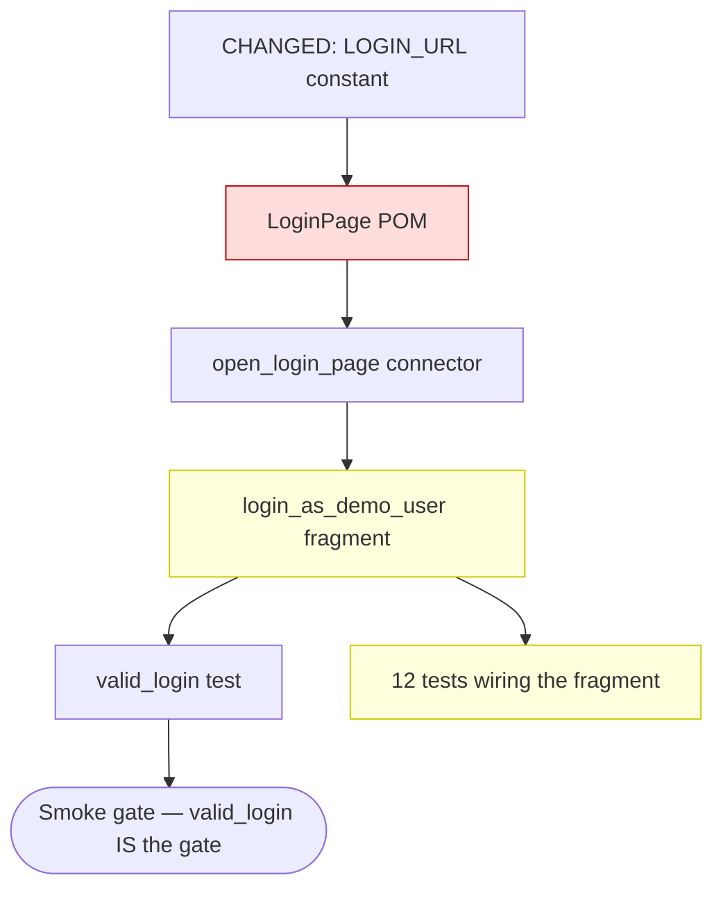

# Assess impact — forward from a change to its blast radius

An assessment skill, and the **forward dual of `diagnose-root-cause` / `diagnose-flake-root-cause`**. The diagnose skills walk _backward_ — symptom →
cause. This one walks _forward_ — change → consequences — along the very same dependency graph. Where RCA asks "what produced this red?", impact
analysis asks "what will this change touch?".

## The dependency graph it walks

The Ocarina suite has one formalized dependency chain (`CLAUDE.md`):

```
constants → POMs (selectors = the POM's "contract with the DOM") → connectors → scenarios / fragments → tests → suites → campaigns → cycle
```

Cross-cutting nodes touch many of the above at once: the adapters (`act`, `TestSuite`, `TestCampaign`, `match_page`, `EnvGetters`),
`transient_errors`, the `logs.py` handler factories, watchers, the drivers pool.

The project's conventions — compartmentalisation (one canonical module per literal), POM selectors at the top of the class, thin connectors — exist
**precisely so this walk is bounded**: a changed URL touches one constant, a changed selector touches one POM. Impact analysis cashes in that
discipline. Its corollary: if a change lands on a literal that is _not_ compartmentalised (a URL inlined across five scenarios), the blast radius is
scattered and untraceable — that is itself a finding, cross-referenced to `review-compartmentalisation-leaks`.

## The one rule that governs all others

**Trace the edge, don't guess the reach.** Every node marked "affected" must rest on a real dependency edge you followed — an import line, a call
site, a wiring. "Probably touches X" is the failure mode. An impact map padded with maybes is as useless as one with gaps: the reader can't tell
traced-and-real from guessed.

## Step 0 — Identify the change and its entry node

Three change origins; each picks where the walk starts:

| Origin                          | The change                                                                        | Entry node                                           |
| ------------------------------- | --------------------------------------------------------------------------------- | ---------------------------------------------------- |
| **SUT change**                  | the app changed — new / removed element ID, changed redirect, validation, or page | the POM selectors and behaviour-claims that touch it |
| **Suite refactor (pre-flight)** | about to move a constant, rename a connector, change a selector, relocate a test  | the node about to change                             |
| **Shared-component cause**      | `diagnose-*` localized a root cause to a shared POM method / fragment / selector  | that component                                       |

(A spec/FRD change is owned by `update-frd-and-tests`; a browser/driver upgrade is a narrow matrix sub-case of the SUT origin.)

State the change in one sentence and name the entry node(s) explicitly.

## Step 1 — Walk the graph forward (downstream)

From the entry node, follow dependency edges downstream — who imports, calls, or wires this. The tooling is `grep` for the exact symbol:

- **Constant changed** → grep the constant name → POMs / scenarios / connectors importing it.
- **Selector changed** → the POM owning it → connectors calling that method → scenarios → tests.
- **POM method changed** → connectors → scenarios / fragments → tests.
- **Fragment changed** → every test wiring it via `pre_test_scenarios_fragments` / `post_test_scenarios_fragments`.
- **Test moved / renamed** → its suite → campaign → cycle (does it cross the smoke gate?).
- **Adapter / `transient_errors` / `logs.py` factory / watcher changed** → potentially the whole suite — say so, and do not pretend the radius is
  small.

Record the **edge** for each hop — the import line, the call site, the wiring. That edge is the citation behind the verdict.

## Step 2 — Also walk the behaviour-claims (the SUT origin's hidden radius)

A SUT change does not only break selectors — it can silently invalidate **claims**. A POM comment, docstring, or `transient_errors` entry asserting
"the SUT does X" is a node too. When the SUT changed, every load-bearing behaviour-claim in or downstream of the changed area is suspect **even if no
selector broke** (per `CLAUDE.md` → "Verify SUT behaviour — don't theorise"). These are the impact most often missed, because the suite still compiles
and the grep for a selector finds nothing.

## Step 3 — Classify each affected node

| Verdict                    | Means                                                                  | Motion                                                      |
| -------------------------- | ---------------------------------------------------------------------- | ----------------------------------------------------------- |
| **broken**                 | the selector / URL / path the node depends on no longer exists         | must update; cite the dead edge                             |
| **stale behaviour-claim**  | a load-bearing "the SUT does X" is now suspect                         | re-verify → `empiricism` / `write-a-probe`                  |
| **gap-test may flip**      | an intentional-fail's premise may no longer hold (SUT bug fixed?)      | `update-frd-and-tests` — reframe, never silently turn green |
| **coverage gap opens**     | the change created a new case nothing covers                           | `extend-coverage`                                           |
| **crosses the smoke gate** | a test moved in/out of smoke, or smoke now depends on the changed code | flag prominently — smoke gates the whole cycle              |
| **reverify-only**          | wired downstream but probably fine                                     | run it; confirm green                                       |
| **unaffected (cite why)**  | traced and ruled out                                                   | none — but record it, so the map shows what was cleared     |

`unaffected (cite why)` is not filler: an impact map is only trustworthy if it shows what was **checked and cleared**, not only the hits. A node
absent from the map reads as "not yet traced", which is a different and worse thing.

## Step 4 — Render the blast-radius diagram

A Mermaid dependency-slice — the `CLAUDE.md` PR "hierarchy slice", generalized to the full graph. The changed node at the root, edges downstream, each
node styled by verdict. It belongs in the skill's surfaced report (its Markdown deliverable — not the repo, not Ocarina's `.reports/`).



## Surface — the impact report

```markdown
# Impact assessment — <change> (<date>)

## Change

<one sentence> — origin: <SUT change | suite refactor | shared-component cause>. Entry node(s): <…>.

## Blast radius

| Node                     | Edge traced                    | Verdict                | Motion                        |
| ------------------------ | ------------------------------ | ---------------------- | ----------------------------- |
| `LoginPage._url`         | imports `LOGIN_URL`            | broken                 | update the constant reference |
| `login_as_demo_user`     | calls `open_login_page`        | reverify-only          | run the 12 tests wiring it    |
| `unauthenticated_access` | does NOT use the auth fragment | unaffected (by design) | none                          |

## Dependency slice

<the Mermaid diagram>

## Smoke-gate crossing

<none | which test, in or out, and what it now gates>.

## Recommended motions

<per verdict — dispatch below>.

## Verdict

<one line: N nodes affected — K broken, M behaviour-claims to re-verify, J gap-tests may flip; smoke <crossed / untouched>>.
```

## Dispatch — which skill follows

- `stale behaviour-claim` → `empiricism` / `write-a-probe` to re-verify the SUT claim.
- `gap-test may flip` → `update-frd-and-tests` (reframe the intentional-fail; never silently green).
- `coverage gap opens` → `extend-coverage`.
- the change **orphaned** a node (nothing depends on it any more) → `review-dead-code`.
- the change **caused a red** → `diagnose-root-cause` (deterministic) / `diagnose-flake-root-cause` (intermittent) — the backward dual.
- the entry came from a `diagnose-*` shared-component cause → this skill **is** the continuation: it scopes how far that root cause contaminates.
- the change is structural (tests move across the hierarchy) → `pr-report` carries the hierarchy slice into the PR.
- the change landed on a non-compartmentalised literal → `review-compartmentalisation-leaks`.

## When to run this skill

- **Before** a refactor PR — pre-flight the blast radius so the PR's scope is known, not discovered.
- **After** a SUT change or redesign — find what is now broken or stale.
- **After** `diagnose-root-cause` / `diagnose-flake-root-cause` localizes a cause to a shared component — scope the contamination radius.
- The user asks: "what does changing X affect?", "what's the blast radius?", "what's stale now the app changed?", "what else does this root cause
  contaminate?".

## What this skill does NOT do

- It does not apply the changes — it surfaces the map; the user (or the dispatched skill) acts.
- It does not guess reach — every edge is traced and cited. An untraceable literal is a finding, not a shrug.
- It does not diagnose failures — that is the `diagnose-*` pair, the backward dual.
- It does not propagate a spec change — that is `update-frd-and-tests`.
- It does not commit the diagram — the Mermaid lives in the skill's surfaced report, not the repo.
