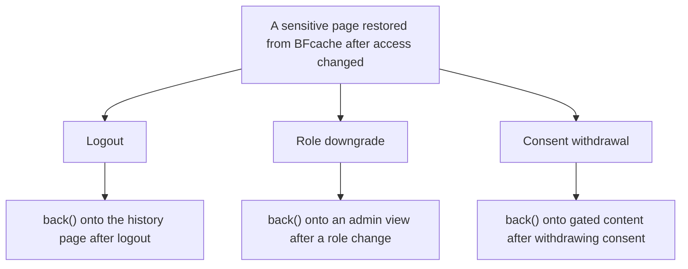

# BFcache-exposure ideation — what's reachable via Back after an access change?

A black-hat ideation skill, sibling to `business-attack-ideation`, `incoherence-attack-ideation`, `persistence-attack-ideation`, and
`permission-appropriateness-audit`. This one is laser-focused on a single mechanism:

> _The browser's back-forward cache (BFcache) keeps the previous page **as it rendered**. After an access-changing event — logout, expiry, role switch
> — the server-side state has moved on, but pressing Back can restore the pre-event render. Whatever was on that page is now exposed._

The project already has one BFcache finding: `§B-BROWSER-1` in the gap inventory, with the dedicated `BackForwardCacheExposureError` exception and the
Chrome-vs-Firefox contrast pair. That finding is one _instance_ of a broader pattern. This skill systematically walks every access-changing event in
the SUT and surfaces every place the same pattern could expose data.

Same hard rule as the rest of the trio: functional, UI-only. Per `CLAUDE.md` → _"Security testing is functional and static — never active"_. The user
presses Back. The browser shows what it shows. The audit observes.

## What makes a BFcache exposure

Three conditions must coincide:

1. **A page rendered with sensitive content** (an authenticated dashboard, a record being edited, a list of records visible only to a role).
2. **An event that changes the user's access** (logout, expiry, role switch, consent withdrawal, record deletion).
3. **A back-navigation primitive that restores the pre-event render** (Back button, Forward, tab restore, `history.back()` via a UI link).

When all three line up, the user sees data they no longer have access to — _via legitimate browser interaction_. Whether the SUT considers this a
vulnerability is a product decision; the skill's job is to surface every line-up so the team can decide.

## The hard line

In scope:

- The user presses Back / Forward / Refresh / closes-and-reopens-tab / restores-tab. All legitimate browser primitives.
- The user reads what the browser renders. No DOM editing, no DevTools panels (except observationally — see `analyse-flakiness` / `write-a-probe` for
  diagnostic motions, kept separate from ideation).

Out of scope:

- Editing the BFcache state via DevTools. Out.
- Forging session tokens to "stay logged in past logout". Out.
- Server-side replay attacks. Out.
- Anything that requires reaching past the rendered page. Out.

The line: **the user navigates with browser controls; the audit observes what the browser displays.**

## The eight access-changing events to walk

For each event, ask: _immediately before this event, what page might be in the user's history? Is its content sensitive? Does Back restore it?_

### 1. Logout

The original `§B-BROWSER-1` shape. The user logs out from a page that was authenticated; Back restores that page.

- **Concrete example**: documented — logged-in history page → logout → Back → history page restored (Chrome). Firefox redirects (the contrast pair).
- **Detection question**: which authenticated pages, if visited last before logout, are still rendered on Back?
- **Per-page enumeration**: walk every page reachable while authenticated (login-redirected pages, history, profile, appointment form, etc.) and pair
  each with the logout event.

### 2. Session expiry (server-side)

The user's session expires while they're elsewhere; they come back, press Back. The previous page (rendered while session was live) restores.

- **Detection question**: does the SUT distinguish "logout-initiated" from "expiry-initiated" navigation back? Often not.
- **Test shape**: simulate expiry by waiting (or by setting the cookie's expiry to past via the page's logout flow), then Back.

### 3. Role switch / impersonation end

In multi-role SUTs, switching from a high-privilege role to a lower-privilege one — or ending an impersonation session — leaves the high-privilege
page in history.

- **Concrete example**: not applicable (single role). For multi-role SUTs: surface as a checklist item.
- **Detection question**: after switching from admin to user, does Back restore the admin dashboard?

### 4. Consent withdrawal

The user withdrew consent for a feature; the previous page rendered with the feature enabled. Back restores.

- **Concrete example**: not directly applicable. For SUTs with GDPR-shaped consent gates, this is high-value.
- **Detection question**: is the previously-consented content reachable via Back?

### 5. Record deletion

The user deleted a record; the previous page showed the record. Back restores a view of a record that "no longer exists".

- **Concrete example**: cancel an appointment, press Back — does the appointment-detail page restore? The cancellation is real server-side, the Back
  view is a phantom.
- **Detection question**: does the SUT's content remain accessible after deletion? Even if just for a Back-restored view, that's an audit-trail
  question.

### 6. Save / cancel of a sensitive draft

The user was editing a draft (with sensitive content in the form), navigated away or saved-then-cancelled. The draft page is in history.

- **Detection question**: does Back restore the draft including the values that were typed before save / cancel? Is the sensitivity expected?

### 7. Cross-tab logout (cross-context)

The user has tab A authenticated; logs out in tab B; goes back to tab A and presses Back. Tab A's history hasn't seen the logout event.

- **Concrete example**: surface for multi-tab SUT flows.
- **Detection question**: does the SUT have a mechanism (e.g. broadcast channel, polling) to invalidate tab A's history? If not, Back in tab A may
  restore pre-logout views.

### 8. Tab restoration after browser restart

The user closed the browser (or tab) on a sensitive page; reopens with "restore previous session" or "reopen closed tab". The browser may restore the
DOM from cache.

- **Detection question**: does the SUT depend on always-fresh requests on tab restore, or will the rendered DOM display sensitive state from before
  the close?

## Attack tree

Render the surfaced catalogue as a Mermaid **attack tree**: the root is the exposure, the middle layer is the eight access-changing events above (one
branch each), the leaves are the concrete back-navigation scenarios. It belongs in the skill's surfaced report (its Markdown deliverable, not the
repo) — never commit it; the durable artifacts are the scenarios.



Each leaf is a back-button press — confirm with the `back()` → `refresh()` check (per `CLAUDE.md`).

## Procedure

### Step 1 — Enumerate the authenticated / role-gated / consent-gated pages

```bash
grep -rn -i "auth\|login\|role\|consent\|sensitive" src/pages
grep -rn -i "REQ-" the FRD | grep -i "auth\|access"
```

Build the list. For example, in <https://github.com/mojo-molotov/ocarina-with-ai-example>: every page reachable after `DEMO_USERNAME` login (history,
profile, appointment form, the booking confirmation).

### Step 2 — Walk the eight events × pages matrix

For each (page × event), ask:

- Is this combination plausible (does the page exist in the user's flow before the event)?
- Is the page's content sensitive enough that exposure via Back would matter?
- Has anyone already encoded this? (Check the existing scenario set — the SUT's BFcache work covers logout × history.)
- Is the event applicable to this SUT? (Role switch, consent withdrawal don't apply to single-role / no-consent SUTs — note as "checklist for
  future".)

### Step 3 — Cross-check against existing artifacts

- Documented in `§B-BROWSER-1`? — cross-reference, don't duplicate.
- Encoded as a test? Most BFcache work in the project is around the `BackForwardCacheExposureError` exception flow. List which (page × event) combos
  are already covered.
- Adjacent `persistence-attack-ideation §4` (back/forward/refresh insistence)? — note the relationship; this skill focuses on the _single-Back
  exposure_, the sibling on _insistent_ navigation.

### Step 4 — Cross-check against the hard line

For each proposal: does the test shape require anything beyond pressing Back and reading the rendered page? If yes — drop.

### Step 5 — Surface the catalogue

```markdown
# BFcache-exposure catalogue — `<SUT>` (<date>)

## Authenticated / gated pages enumerated

- `<page>` — gate: `<auth | role | consent | other>`. Sensitivity: `<short note>`.
- ...

## Exposure scenarios

### Logout

- **Page `<name>` → logout → Back**: <observation per existing finding | candidate for new test>.
  - Cross-reference: `§B-BROWSER-1` (history page covered) | new.
  - Test shape: drive `<page>` → logout → `driver.back()` → assert `BackForwardCacheExposureError`-style raise (or whichever assertion shape the suite
    uses for the existing finding).
  - Detection question: <one sentence>.

### Session expiry

- ...

### Role switch (N/A for single-role SUTs; surface as future-checklist item)

### Consent withdrawal (N/A if no consent gates; surface as future-checklist item)

### Record deletion

- **Cancel appointment → Back**: does the appointment-detail page restore? Phantom view of a cancelled record. Cross-reference: not yet covered.

### Draft save / cancel

- ...

### Cross-tab logout

- ...

### Tab restoration

- ...

## Cross-references

- `§B-BROWSER-1` — the existing finding; this skill generalises around it.
- `BackForwardCacheExposureError` (`src/lib/errors.py`) — the non-transient exception used for the existing assertion shape.
- Sister skills: `persistence-attack-ideation §4` (insistent back-navigation), `business-attack-ideation`, `incoherence-attack-ideation`,
  `permission-appropriateness-audit`.

## Recommended next motions

- For each candidate: `empiricism` to observe the SUT's behaviour, then `extend-coverage` to author the test (likely as a Chrome-fail / Firefox-pass
  pair, mirroring `§B-BROWSER-1`).
- For each N/A-future-checklist event: note for the FRD; when the SUT acquires roles / consent, the lens is ready.

## Verdict

<one-line: N candidates, K already covered, J N/A-for-this-SUT, nothing material>.
```

Print the catalogue.

### Step 6 — Stop. The user decides.

Each candidate resolves as:

- **Encode** — `empiricism` to verify the BFcache shape on the SUT's deployment (browser-version-sensitive — Chrome's BFcache eligibility rules
  change), then `extend-coverage` to author the assertion pair (Chrome-fail, Firefox-pass, mirroring the existing finding).
- **Discuss** — product/legal call. Some "exposures" are intentional (a typical e-commerce checkout flow's Back restores the cart on purpose).
- **Defer** — record for the next coverage push.

## Hard rules

- **Browser controls only.** Press Back, Forward, Refresh, reopen tab. Read the page. Stop. Any move past that surface drops the proposal.
- **Cross-reference `§B-BROWSER-1` aggressively.** The existing finding is the template for the assertion shape, the contrast-pair encoding, and the
  documented mechanism. New BFcache findings should mirror that shape.
- **Browser version matters.** Chrome's BFcache eligibility changes across versions (the project's documented finding holds at the time of writing —
  re-verify on bumps). When encoding, note the browser version observed.
- **Firefox usually contrasts.** The existing finding's Firefox side redirects on Back; if a new candidate behaves identically across browsers, that's
  itself worth surfacing.
- **No-storage attempts to _force_ BFcache.** Don't propose tests that manipulate `Cache-Control: no-store`, the BFcache eligibility flags, or any
  page-internal hack to make the cache hit / miss. The audit observes; the cache decides.
- **Per `CLAUDE.md`: security testing is functional and static — never active.** This skill's UI-only surface satisfies that. Never escalate to active
  techniques.

## When to run this skill

- After `§B-BROWSER-1` lands — generalise to other (page × event) combinations.
- A new authenticated page is added — does it have a logout-then-Back exposure?
- A new access-changing event is added (session timeout, role-switch, consent flow) — apply the lens.
- A Chrome version bumps in CI — re-verify the existing finding still holds (browser bump may flip eligibility) and re-walk the catalogue.
- Onboarding a contributor to the BFcache work — the catalogue is a useful map.

## What this skill does NOT do

- It does not encode tests. Use `empiricism` + `extend-coverage` after the team picks candidates.
- It does not run probes. Use `write-a-probe` for the BFcache observation if a candidate's behaviour is unclear.
- It does not propose DevTools manipulation, DOM editing, eligibility-flag tricks, or any active-security technique.
- It does not produce attack payloads.
- It does not file the gap inventory entries directly. Cross-references are recommended; entries are a follow-up via `update-frd-and-tests`.
- It does not assess whether an exposure is _acceptable_ — that's a product / legal / compliance call. The audit surfaces; the team decides.
