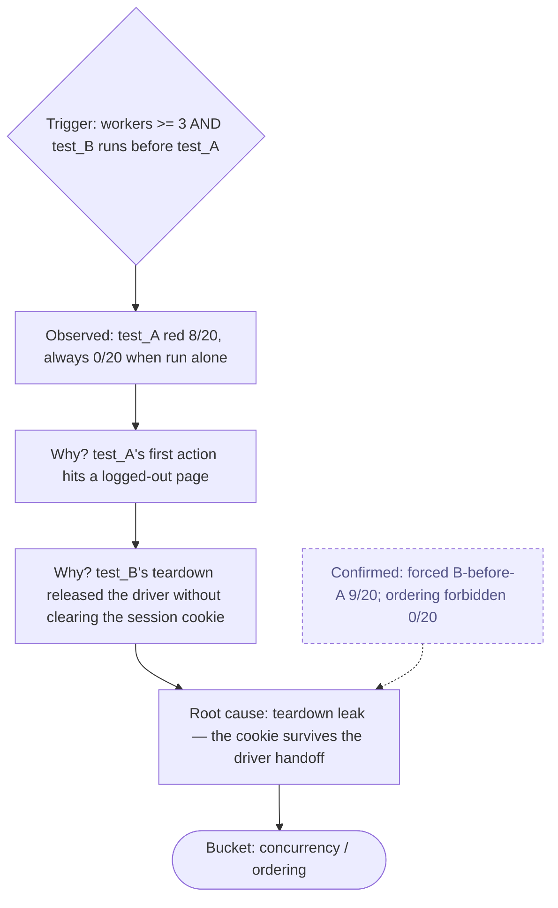

# Diagnose flake root cause — the distribution is the evidence

A diagnostic skill, and the **sibling of `diagnose-root-cause`**. That skill root-causes a _deterministic_ red — reproducible, walkable symptom→cause,
confirmed by one probe. This skill root-causes an _intermittent_ one — a **flake** — and the methodology is deliberately different, because a flake
breaks the assumption the deterministic walk rests on: that you can re-run, observe, and trust what you see.

## Why the methodology differs — read this first

`diagnose-root-cause` and `diagnose-flake-root-cause` are **two skills on purpose**. Using one's method on the other's failure wastes the
investigation.

| Dimension               | `diagnose-root-cause` (deterministic)           | `diagnose-flake-root-cause` (intermittent)                           |
| ----------------------- | ----------------------------------------------- | -------------------------------------------------------------------- |
| The failure             | reproducible — fails every run                  | intermittent — red some runs, green others                           |
| What counts as evidence | this run's concrete state, re-derived           | the **failure rate** across many runs — one run proves nothing       |
| Reproduce by            | re-running once                                 | **raising the rate** — replay × stress (workers, ordering)           |
| Isolate by              | the synthetic→real ladder, narrowing to one act | **correlation** — which covariate predicts the red                   |
| Where the cause lives   | the test logic or the SUT, at the failing act   | the **execution environment** — concurrency, ordering, timing, state |
| Confirmed by            | one probe, 5/5 exact-target                     | the rate moved as predicted — "8/20 under stress X, 0/20 without"    |
| The diagram's root      | a single symptom                                | a **trigger condition** ("when workers ≥ 3 and B precedes A")        |

If Step 0 shows the failure is actually deterministic, **stop and switch to `diagnose-root-cause`**. The reverse handoff is in that skill's Step 0.

## The one rule that governs all others

**A single run never proves or disproves a flake.** A green run does not mean fixed; a red run does not mean broken; the next run is not a tiebreak.
Only the **distribution** — N runs, a failure rate, and what that rate correlates with — is evidence. Every step below reasons about the distribution,
never a single observation.

## Step 0 — Establish the failure rate

Re-run the suspect test in isolation, then under the project's normal `--workers`, enough times to get a rate (default 20 runs; more if the rate looks
below ~10%).

- **Fails 0/N in isolation but k/N under workers** → a real flake, and the worker dimension is already a lead. Continue.
- **Fails every run** → not a flake. Stop. Switch to `diagnose-root-cause`.
- **Fails 0/N everywhere now** → either resolved, or the rate is below your N. Raise stress (more workers, saturation, the suspected ordering) before
  concluding "gone" — a flake unobserved is not a flake fixed.

Record the rate. It is the baseline every later step is measured against.

## Step 1 — Pin the flake signature

A flake has a **signature**: the pattern of which runs fail. Build the distribution table — one row per run — and for each run capture the covariates:

| Covariate             | Why it matters                                         |
| --------------------- | ------------------------------------------------------ |
| Worker id / count     | concurrency, driver-pool contention                    |
| Test position / order | ran first? after test X? — ordering & cross-test state |
| Neighbour tests       | a specific predecessor leaking state                   |
| Browser               | a browser- or driver-specific race                     |
| Watcher attached      | the concurrent-observer surface                        |
| `[COPY N]`            | a saturation clone — concurrency by construction       |
| SUT load / time       | shared-dyno contention, cold start                     |
| Life it died on       | exhausted the retry budget, or recovered late          |

Don't average it away — the table _is_ the finding-in-progress.

## Step 2 — Correlate: the covariate that predicts the red picks the instrument

Find the covariate the failure tracks. That correlation is both the hypothesis and the routing decision:

| The red correlates with…                         | Hypothesis                                  | Route to                                       |
| ------------------------------------------------ | ------------------------------------------- | ---------------------------------------------- |
| dying under retries, a specific exception class  | the transient-error classifier is mis-set   | `analyse-flakiness`                            |
| first action / worker / order / a neighbour test | the setup/teardown boundary leaks or wedges | `analyse-fixture-flakiness`                    |
| a watcher being attached                         | the concurrent-observer surface             | `analyse-watcher-flakiness`                    |
| a visible overlay in some screenshots            | an intermittent overlay covers the target   | `analyse-screenshot-flakiness`                 |
| nothing in the table — only SUT load / time      | environmental nondeterminism, SUT-side      | `understand-sut-constraints`, `question-state` |

If the red correlates with **nothing** — the rate is flat across every covariate — that itself is a finding: suspect an intermittent SUT defect, or a
timing window finer than the covariates you captured; widen the table before concluding.

## Step 3 — Run the routed `analyse-*` experiment

This skill is the **orchestrator**; the `analyse-*` skills are the controlled experiments. Hand off to the one(s) Step 2 selected, run them, collect
their reports. A flake often has layered causes — if the first experiment explains only part of the rate, route the residue to the next.

## Step 4 — Raise the rate to confirm — don't chase one red

The flake-equivalent of the deterministic probe. You have _not_ confirmed a cause by getting one red. You confirm by **moving the rate as predicted**:

- Make the suspected condition more frequent (more workers, `saturate_workers`, a forced ordering) → the rate should climb.
- Remove the suspected condition → the rate should drop to ~0.

"8/20 with the condition, 0/20 without" is a confirmed cause. An N-attempt determinism probe (`write-a-probe`, Template B) is the tool when the
condition is reproducible outside the suite.

## Step 5 — Build the causal chain — rooted at a trigger condition

Render the chain as Mermaid in the skill's surfaced report (its Markdown deliverable — not the repo, not Ocarina's `.reports/`). Unlike the
deterministic diagram, the root is a **trigger condition**: the flake fires only when it holds.



The trigger condition is what makes the flake _reproducible on demand_ — without it, the diagram is just a story.

## Step 6 — Classify the flake root cause — five buckets

| Bucket                           | Means                                                                            | Lands in                                                                        |
| -------------------------------- | -------------------------------------------------------------------------------- | ------------------------------------------------------------------------------- |
| **Concurrency / ordering**       | shared state, a race, worker / pool contention, an order dependency              | gap inventory (env section); fix the isolation, or `understand-sut-constraints` |
| **Timing window**                | a wait usually-but-not-always enough — hydration, animation, redirect race       | the fix is the right wait condition, not a longer timeout; cite the `analyse-*` |
| **Environmental nondeterminism** | SUT load, cold start, shared dyno, network — outside the test                    | gap inventory (env section); `question-state`; no test-code change              |
| **Intermittent SUT defect**      | the app itself is non-deterministic — a real bug                                 | gap inventory + FRD known-bugs; the test stays as a red-sometimes signal        |
| **Transient-classification gap** | a genuinely-transient error is classed non-transient; the budget would absorb it | a deliberate `src/lib/errors.py` change, per `analyse-flakiness`                |

A flake can land in two buckets — record both; don't force one.

## Surface — the flake-RCA report

```markdown
# Flake root-cause analysis — <test name> (<date>)

## Failure rate

Baseline: <k/N> isolated, <k/N> under <workers>. <N> runs total.

## Signature

The red correlates with: <covariate>. Flat against: <covariates ruled out>.

## Experiments run

- `analyse-<x>` → <what it showed>.

## Confirmation

Rate with the trigger condition: <k/N>. Rate without it: <k/N>.

## Causal chain

<the Mermaid flowchart, rooted at the trigger condition>

## Root cause

<one or two sentences, stated with the rates — never with a single run>.

## Bucket(s)

<one or two of the five> → <where the finding lands>.

## Recommended motion

<fix the isolation | the right wait condition | reclassify the error | file the environment gap | introduce-pom-retries two-test split>.
```

## Dispatch — which skill follows

- Proved deterministic at Step 0 → `diagnose-root-cause`.
- The chosen experiment → `analyse-flakiness` / `analyse-fixture-flakiness` / `analyse-watcher-flakiness` / `analyse-screenshot-flakiness`.
- Confirmation needs an N-attempt probe → `write-a-probe` (Template B — determinism probe).
- A shared SUT-side scarcity is implicated → `understand-sut-constraints`.
- The fix is a retry that must stay honest → `introduce-pom-retries` (the two-test split keeps the flake demonstrated, not buried).
- Finding is user-facing (an intermittent SUT defect) → `update-frd-and-tests`.

## When to run this skill

- The user says: "root-cause this flake", "why is this test red only sometimes", "diagnose this non-deterministic failure", "it passes locally but
  fails in CI".
- `diagnose-root-cause` Step 0 found the failure intermittent and handed off here.
- `review-suite-stability` surfaced a surprise red that does _not_ survive re-runs.

## What this skill does NOT do

- It does not run the controlled experiments itself — it orchestrates; the `analyse-*` skills are the experiments.
- It does not conclude from a single run — green or red, one run is never the evidence; the rate is.
- It does not "fix the flake" by widening a timeout or adding a blind retry — the bucket dictates the real motion.
- It does not handle deterministic reds — those are `diagnose-root-cause`'s job.
- It does not commit the diagram — the Mermaid lives in the skill's surfaced report, not the repo.
