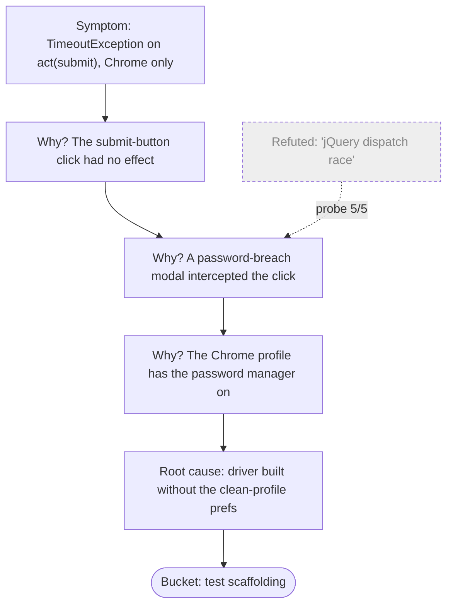

# Diagnose root cause — symptom to cause, re-derived

A diagnostic skill, and the **sibling of `diagnose-flake-root-cause`**. `review-report` classifies a run's FAILs and SKIPs; the `analyse-*` skills run
flakiness experiments. This skill takes one **deterministic red** — a regression, a real defect, a cross-browser divergence, a deployment drift, a
tool artifact — and walks it from "this test fails" to "here is the root cause, classified, with the evidence".

Its sibling owns the _intermittent_ case. That is a deliberately different discipline — distribution-based, not single-run — and the two are kept
**separate on purpose**; the full contrast table lives in `diagnose-flake-root-cause`. If Step 0 shows the failure is a flake, this skill stops and
hands off there.

The methodology is the `CLAUDE.md` hard-won rules made invokable: "Evidence is local — re-derive", the synthetic→real escalation ladder, "a
cross-browser difference is a finding", "verify SUT behaviour — don't theorise", the back-then-reload check. This skill is the workflow that sequences
them.

## The one rule that governs all others

**Re-derive from this run's evidence.** A prior run's diagnosis, a stale comment, an old screenshot, a teammate's guess — each describes a _past_
failure. For the failure in front of you they are **hypotheses to test, not conclusions to inherit**. Stacking a fix on an unverified inherited
diagnosis is what ends in a reboot. One extra check is cheap.

## Step 0 — Is it deterministic?

RCA only applies to a **deterministic** failure. Before anything else, re-run the exact failing test in isolation, a handful of times (default 4).

- **Fails every time** → deterministic. Continue this skill.
- **Fails intermittently** → it is a flake. Stop. Switch to `diagnose-flake-root-cause` — flakes need the distribution-based discipline (a failure
  rate, a signature, correlation), not this deterministic walk. RCA on a flake with this skill's method chases a cause that isn't stable.
- **Passes every time now** → the red was environmental or already fixed; interrogate with `question-state` before declaring it resolved.

## Step 1 — Pin the exact failure surface

From the run's logs / report (`pick-logs`, `pick-reports`, `review-report`), state with no ambiguity:

| Dimension      | What to pin                                                                                                          |
| -------------- | -------------------------------------------------------------------------------------------------------------------- |
| **Test**       | the exact test, campaign, suite                                                                                      |
| **Step**       | which `act` in which `drive_page` — the _terminal_ failing act, not the test as a whole                              |
| **Exception**  | the exact class + message — `TimeoutException`, `AssertionError`, a dedicated error, a Selenium `WebDriverException` |
| **Browser**    | which browser(s); does it pass elsewhere? — that is Step 6                                                           |
| **Since when** | first red run vs always-red; a regression has a "last good" commit / deploy                                          |

A failure you cannot pin to one act is not ready for RCA — narrow it first.

## Step 2 — Re-derive, don't inherit

List every prior diagnosis attached to this failure surface: the comment on the POM method, the gap-inventory entry, the last person's guess, the
previous screenshot burst. Write each down as a **hypothesis**, explicitly. Then set them aside — you will _test_ them, not assume them.

## Step 3 — Read the symptom honestly

The exception class is the first evidence, not the diagnosis:

- `TimeoutException` on a wait — the element never reached the awaited condition. _Why_ is the question, not _that_.
- `AssertionError` — the SUT produced output the test didn't expect. The SUT may be right and the test wrong, or vice versa.
- A dedicated error (e.g. `BackForwardCacheExposureError`) — the test already encoded a diagnosis; verify the encoded claim still holds.
- Selenium `WebDriverException` — driver/browser-level; rarely a SUT defect, often a tool artifact (Step 4).

## Step 4 — Locate the boundary: the synthetic→real ladder

For an interaction failure the decisive question is **"would a real person, doing exactly this in this browser, hit the same wall?"** Answer it
empirically — escalate from the synthetic automation path toward a real user's, and watch where it starts working:

```
synthetic .click()
  → fresh re-find then .click()
    → keyboard submit (Keys.ENTER)
      → ActionChains move-and-click
        → CDP trusted input event
```

Where it starts working is the boundary:

- Works only at the **CDP-trusted** end → **tool artifact**: the driver's synthetic event was the problem, not the app. Fix the test / POM.
- Fails **even with a real trusted event** → **real defect**: a user hits it too.

Do not conclude this by reasoning. Escalate and observe.

## Step 5 — Read the SUT source when the claim is server-side

If the root-cause hypothesis is server-side — a redirect, session lifecycle, CSRF, validation, caching — and the SUT source is reachable, read it
(`gh api …`, a clone, or the API contract). Don't theorise about server behaviour the browser can't show you. Cite the file / function in the finding.

For a back-navigation / cache symptom, run the **`back()` → `refresh()`** check: if `back()` stays but `refresh()` redirects, it was a BFcache
snapshot; if `refresh()` also stays, the server itself isn't invalidating — a worse, separate root cause.

## Step 6 — Cross-browser: the divergence is the finding

If the test passes on one browser and fails on another, the divergence **is the result**. Never route around it. Classify which side of the line:

- Real user-facing defect → the test is gold, stays red until fixed.
- Genuine browser / driver interaction defect → gap inventory, keep the test.
- Test scaffolding that only works on one browser → fix the _test_, on **both** browsers, never by skipping one.

## Step 7 — Confirm with a probe

Once the hypothesis is one sentence, confirm it empirically: `write-a-probe`, exact target, N attempts. The probe converts "I think" into "5/5
observed". A root cause without a probe — or a source citation, or a deterministic N-of-N count — is still a hypothesis.

## Step 8 — Build the causal chain

Walk symptom → cause by asking "why" until you reach something actionable (a defect to file, a test to fix, an environment to repair). Render the
chain as a **Mermaid** diagram in the report the skill surfaces — a causal graph is clearer than prose for a multi-link chain, and it makes a _wrong_
link visible:



Keep discarded hypotheses on the diagram as dashed nodes, annotated with _why_ they were refuted — the next reader must not re-walk a dead branch. The
diagram belongs in the skill's **surfaced report only** (the Markdown this skill hands you — not Ocarina's `.reports/`): never commit it into the
repo, where it would drift (per `review-comment-drift`).

## Step 9 — Classify the root cause — five buckets

Every root cause lands in exactly one:

| Bucket                      | Means                                                | Lands in                                                  |
| --------------------------- | ---------------------------------------------------- | --------------------------------------------------------- |
| **Real user-facing defect** | a real person hits this through the browser          | gap inventory + FRD known-bugs; the test stays red        |
| **Browser / driver defect** | genuine browser or driver interaction bug            | gap inventory; the test is kept and documented            |
| **Test scaffolding**        | only the synthetic automation path is affected       | fix the test / POM (on all browsers)                      |
| **Environment**             | deployment drift, cold start, data state, network    | `question-state`; fix the environment; no code change     |
| **Flake**                   | proved intermittent after all → not this skill's job | hand off to `diagnose-flake-root-cause`; this skill stops |

## Surface — the RCA report

```markdown
# Root-cause analysis — <test name> (<date>)

## Failure surface

Test / step / exception / browser / since-when — per Step 1.

## Hypotheses considered

- <prior diagnosis> — **refuted** by <probe 5/5 | source read | ladder result>.
- <hypothesis> — **confirmed**.

## Causal chain

<the Mermaid flowchart>

## Root cause

<one or two sentences, with the empirical evidence: probe count, source file/line, the ladder boundary>.

## Bucket

<one of the five> → <where the finding lands>.

## Recommended motion

<file the gap | fix the test on both browsers | repair the environment | hand off to diagnose-flake-root-cause>.
```

## Dispatch — which skill follows

- Proved intermittent → `diagnose-flake-root-cause` (which orchestrates the `analyse-*` experiments from there).
- Needs empirical confirmation → `write-a-probe`.
- Server-side claim → read the source (per `CLAUDE.md` → "Verify SUT behaviour").
- Environment suspected → `question-state`.
- Finding is user-facing → `update-frd-and-tests`.
- Arrived here from `review-report` — a body-failure that wasn't an obvious static / smoke-gate / setup error.

## When to run this skill

- The user says: "root-cause this", "why does this test fail?", "explain this red", "troubleshoot this regression", "which side of the line is this
  cross-browser failure?".
- `review-report` classified a FAIL as a body failure that is not an obvious static / smoke-gate / setup error.
- `review-suite-stability` surfaced a surprise red that survives re-runs (a surprise red that _doesn't_ survive is a flake →
  `diagnose-flake-root-cause`).

## What this skill does NOT do

- It does not diagnose flakes — a proven-intermittent failure goes to `diagnose-flake-root-cause`. This skill is for deterministic reds.
- It does not fix the defect or write the gap entry — it produces the RCA; applying the fix / filing the finding is a separate motion
  (`update-frd-and-tests`, or a code change the user signs off).
- It does not conclude by reasoning — every link in the causal chain rests on a probe, a source read, or an observed ladder boundary.
- It does not commit the diagram — the Mermaid lives in the skill's surfaced report (its Markdown deliverable), not the repo.
- It does not inherit a prior diagnosis — every inherited claim is re-tested as a hypothesis.
