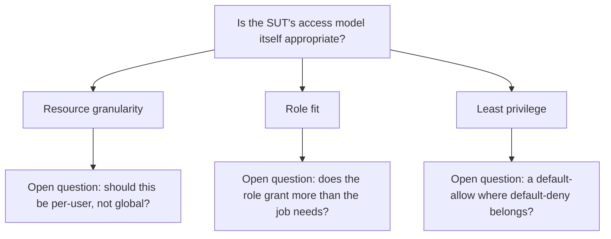

# Permission-appropriateness audit — is the access right, even when enforced?

A static-review skill, sibling to `business-attack-ideation` / `incoherence-attack-ideation` / `persistence-attack-ideation`. Those three look at
_ways the SUT could be abused through legitimate UI_. This one looks at a quieter problem:

> _The SUT enforces exactly what the spec says. The question is whether the spec is appropriate._

A SUT can perfectly enforce a permission model that nobody on the team has read with fresh eyes since it was written. Two roles silently share access
to a sensitive resource; the access is enforced correctly per the matrix; the matrix itself is the issue. The audit reads the matrix (or, when there
isn't one, the implicit access surfaces in the FRD / tests / code) and surfaces appropriateness questions.

Same hard rule as the rest of the black-hat trio: this is **functional, static analysis**. Per `CLAUDE.md` → _"Security testing is functional and
static — never active"_. No bypass attempts, no probing, no active exploitation. Just careful reading.

## What "appropriate" means here

There's no universal answer to _should role A and role B share access to resource R?_ — appropriateness is a product / business / compliance / legal
decision. The audit's job is to **surface the question**, not to answer it. The deliverable is a list of _role × role × resource_ triples worth a team
conversation, with the rationale for surfacing each.

Useful framings the audit borrows from when surfacing a question (mirror the _benevolent QA_ tone from `review-spec-gaps`):

- _"Is it intended that role A and role B both have write access to R?"_
- _"Role A has read-all on R; role B has read-own. Is the asymmetry deliberate, or did it drift?"_
- _"Role A is referenced in the FRD; role B is implied by the test scenarios but isn't in the matrix. Is the spec complete?"_

Phrasings to **avoid**:

- ~~"This is a privilege-escalation vulnerability."~~
- ~~"Role A clearly has too much access."~~
- ~~"You forgot to restrict role B."~~

## The seven appropriateness lenses

For each lens, walk the SUT's access surface and surface the questions it produces.

### 1. Role-pair parity on sensitive resources

Two distinct roles with **identical access level** to the same resource. The parity itself is the question — distinct roles usually exist to make
distinct access choices.

- _"Roles A and B both have full read on R. Why are they distinct roles?"_
- _"If they need distinct names, do they need distinct access?"_

### 2. Cross-context role overlap

Roles from **different business contexts** with overlapping resource access. The classic shape: a customer-service rep and a compliance officer both
viewing the same investigation file.

- _"Role A's purpose is X; role B's purpose is Y. Why do they meet on resource R?"_
- _"Is the overlap a legacy artifact, a deliberate cross-cutting choice, or a drift?"_

### 3. Access-level asymmetry vs role seniority

Junior role with higher access than the senior role above it. Usually a drift — the junior role inherited from a now-obsolete config; the senior role
was never re-evaluated.

- _"Role A is the junior version of role B; role A has create-write on R, role B has read-only. Inverted on purpose?"_

### 4. Read-all vs read-own boundaries

Roles with `read-all` access on resources where `read-own` would suffice for their job.

- _"Role A's daily work touches only their own assigned records. Why does the matrix grant read-all?"_

The lens is the principle of least privilege applied through the _role's actual workflow_, not through abstract reasoning.

### 5. Write access where read suffices

Roles with `write` on resources they only need to _consult_. Often a drift from "this role used to need to update X; we removed that need but kept the
permission".

- _"Role A's workflow no longer involves updating R. The matrix still grants write. Cleanup or intentional?"_

### 6. Implicit roles not in the matrix

Roles **referenced in tests, code, or the FRD prose** but absent from the matrix table itself. Reading the matrix alone misses these.

- _"The login test exercises a 'support' user; the matrix has 'agent' and 'admin' only. Where does 'support' fit?"_

This is also a `review-spec-gaps` finding; cross-reference.

### 7. Resource-grouping leakage

A resource that should be split into sub-resources (with distinct access) is treated as one.

- _"The matrix has one entry for 'patient record'. In practice, the record contains medical notes, payment info, and contact details. Should each have
  its own row?"_

The lens forces "resource" to be examined at the granularity the **business** cares about, not the granularity the spec chose.

## Audit tree

Render the audit as a Mermaid **tree**: the root is the appropriateness question, the middle layer is the seven lenses above (one branch each), the
leaves are the open clarification questions you surfaced. It shows which lenses raised something and which came back clean. It belongs in the skill's
surfaced report (its Markdown deliverable, not the repo) — never commit it; the durable artifacts are the questions.



Leaves are clarification questions, not defects — the audit asks; the team answers.

## Procedure

### Step 1 — Locate the access surface

As a concrete example (see <https://github.com/mojo-molotov/ocarina-with-ai-example>): the FRD names only one demo user role. The audit's output will
be short — most of the seven lenses don't produce findings on a single-role SUT. **The first finding is therefore the absence of a permission matrix
itself**: surface that and note the audit's other lenses are ready for the next role.

For SUTs with a real matrix:

```bash
grep -rn -i "role\|permission\|access_level\|RBAC\|matrix" <project>/<spec dir>
```

Read the matrix (or the closest thing to one). Map: rows = roles, columns = resources, cells = access levels. If no explicit matrix exists, build one
from the FRD / test scenarios / source — that derived matrix is _itself_ worth surfacing (you've just discovered the spec doesn't model what the SUT
enforces).

### Step 2 — Apply the seven lenses

For each (role pair × resource) or (role × resource) combination, walk the lenses:

- §1 parity: same role-pair, same access? Surface.
- §2 cross-context: roles from different business worlds meeting on a resource? Surface.
- §3 seniority asymmetry: junior > senior? Surface.
- §4 read-all vs read-own: read-all where read-own fits the workflow? Surface.
- §5 write where read suffices: legacy write permissions? Surface.
- §6 implicit roles: roles in tests / code but not in matrix? Surface.
- §7 resource granularity: bundled resources where the business sees distinct ones? Surface.

Filter:

- **Specified-intentional** (silent) — the spec explicitly states the access is deliberate (often with a _why_).
- **Documented-elsewhere** (silent) — already discussed in compliance docs, ADRs, etc.
- **Open question** — surface as a benevolent appropriateness item.

### Step 3 — Cross-check against existing artifacts

For each surfaced question:

- Adjacent `review-spec-gaps` finding? Cross-reference.
- Already in the gap inventory? Cross-reference.
- Adjacent sibling-skill finding (`business-attack-ideation` etc.)? Cross-reference.

### Step 4 — Cross-check against the hard line

Per item: does the audit suggest _probing_ the SUT in any way (DevTools manipulation, request crafting, role-switching at the protocol level)? If yes
— drop. Static reading only. The deliverable is appropriateness questions; the SUT is never touched.

### Step 5 — Surface the appropriateness catalogue

Use a _benevolent_ tone throughout, like `review-spec-gaps`:

```markdown
# Permission-appropriateness audit — `<SUT>` (<date>)

## Access surface scanned

- Matrix source: `<file path>` | "no explicit matrix — derived from FRD / scenarios / source".
- Roles identified: <list>.
- Resources identified: <list>.

## Open appropriateness questions

### Role-pair parity

- **`<role A>` and `<role B>` both have `<level>` on `<resource>`.** The two roles exist as distinct; the matrix doesn't say whether their parity here
  is deliberate. _Is the parity intentional?_

### Cross-context overlap

- **`<role A>` (`<business context A>`) and `<role B>` (`<business context B>`) both touch `<resource>`.** The shared access is enforced per the spec.
  _Is this overlap a deliberate cross-cutting choice?_

### Seniority asymmetry

- ... (one block per finding, same shape)

### Read-all vs read-own

- ...

### Write where read suffices

- ...

### Implicit roles

- **The test `<test name>` exercises a role named `<implicit role>`, but `<implicit role>` is not in the matrix.** _Should it be?_ (Also a
  `review-spec-gaps` candidate.)

### Resource granularity

- **The matrix treats `<resource>` as a single row. In practice the resource bundles `<sub-A>`, `<sub-B>`, `<sub-C>`.** _Should the rows split?_

## Closed (asked, resolved by cross-reference)

- ... (optional — questions that came up but resolved against existing docs)

## Cross-references

- `review-spec-gaps §<n>` — adjacent spec-clarity findings.
- `the gap inventory <entry-refs>`.
- Sibling skills (`business-attack-ideation`, `incoherence-attack-ideation`, `persistence-attack-ideation`).

## Recommended next motions

- For each question: **specify** (extend the FRD / matrix with the team's deliberate answer) | **adjust** (change the access level, then
  `extend-coverage` to add tests that observe the new boundary) | **defer** (record pending stakeholder input).
- For implicit-role findings: bundle into the next `review-spec-gaps` pass.

## Verdict

<one-line: N appropriateness questions, K resolved by cross-reference, J implicit-role findings, nothing material>.
```

Print the catalogue.

### Step 6 — Stop. The user decides.

Each surfaced question resolves as:

- **Specify** — extend the matrix with a deliberate, justified entry (often: "this parity is intentional because <reason>"). A `update-frd-and-tests`
  motion if the FRD / matrix is the artifact.
- **Adjust** — change the access level. Then `extend-coverage` to author a test that observes the new boundary, and `empiricism` to verify the SUT
  honours the change.
- **Defer** — leave as an open question pending stakeholder / legal / compliance review.

The audit doesn't pick. It surfaces.

## Hard rules

- **Static reading only.** No probing, no DevTools, no role-switching attempts, no protocol-level investigations. The SUT is not touched.
- **Benevolent tone throughout.** Mirror `review-spec-gaps`. Appropriateness is a product question; the audit asks, doesn't declare.
- **No assertions about whether parity is _wrong_.** The audit surfaces the question; the answer is the team's. _"Is this intentional?"_ is the
  phrasing, not _"this is a privilege escalation"_.
- **Per `CLAUDE.md`: security testing is functional and static — never active.** This skill is the static-functional case. No bypass attempts, no
  exploit sketches.
- **Cross-reference `review-spec-gaps` aggressively.** Most permission-appropriateness questions also surface "the spec doesn't define this clearly".
- **One question, one team conversation.** Don't bundle ten questions into one item — each gets a discussion.

## When to run this skill

- The user introduces a multi-role access model.
- A new role is added to the matrix.
- A compliance / legal / audit milestone approaches and the team wants a fresh read.
- After a `review-spec-gaps` pass surfaces role-related ambiguities — this skill is the natural follow-up.
- Onboarding — the access model is the kind of thing that drifts silently, and a fresh-eyes audit is most useful right after a contributor reads the
  domain.

## What this skill does NOT do

- It does not bypass anything. The SUT is not touched.
- It does not encode tests. Use `extend-coverage` / `empiricism` after the team decides which questions to act on.
- It does not propose DevTools manipulation, role-switching tricks, or any active-security technique.
- It does not file the gap inventory entries directly. Cross-references are recommended; entries are a follow-up via `update-frd-and-tests`.
- It does not pick the answer to any appropriateness question. The audit surfaces; the team decides.
- It does not produce attack payloads. Even illustrative ones.
- It does not assess single-role SUTs deeply — for a single-role SUT the audit is brief (no matrix → surface that; lenses are ready when the role
  model grows).
